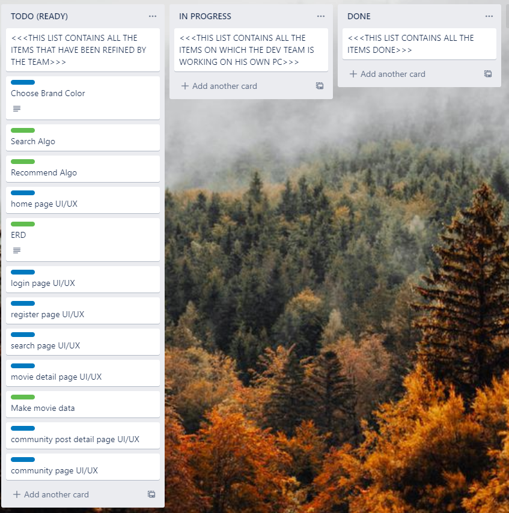
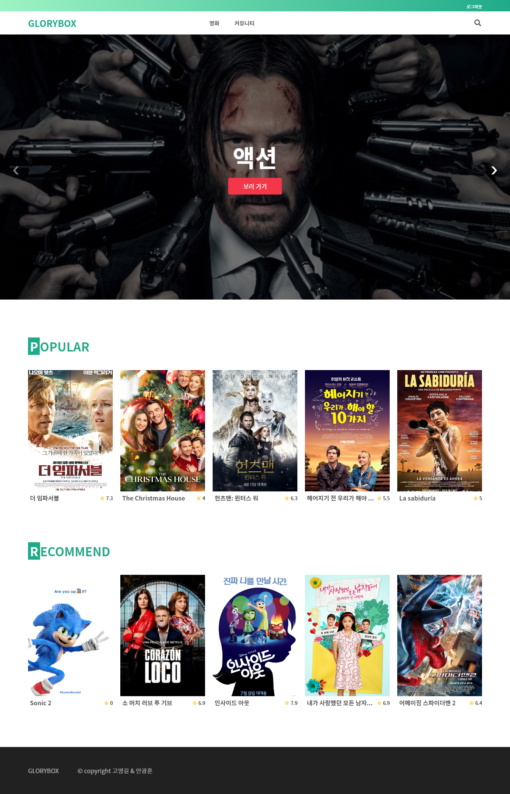
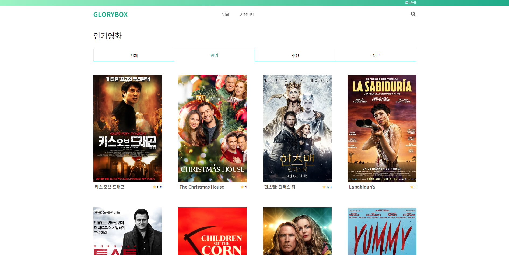
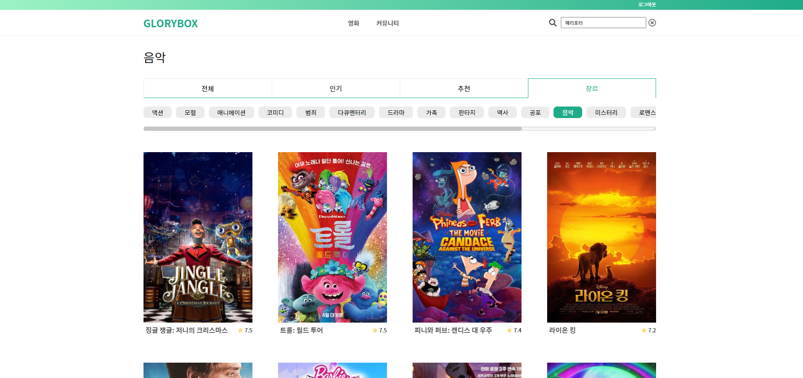
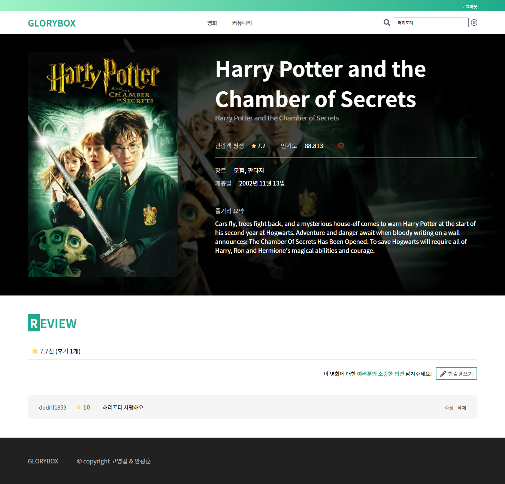
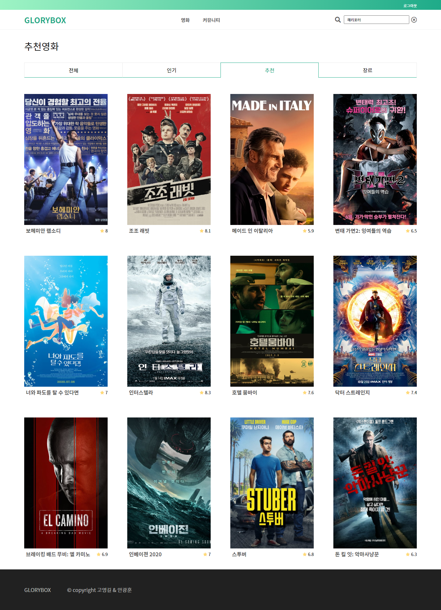
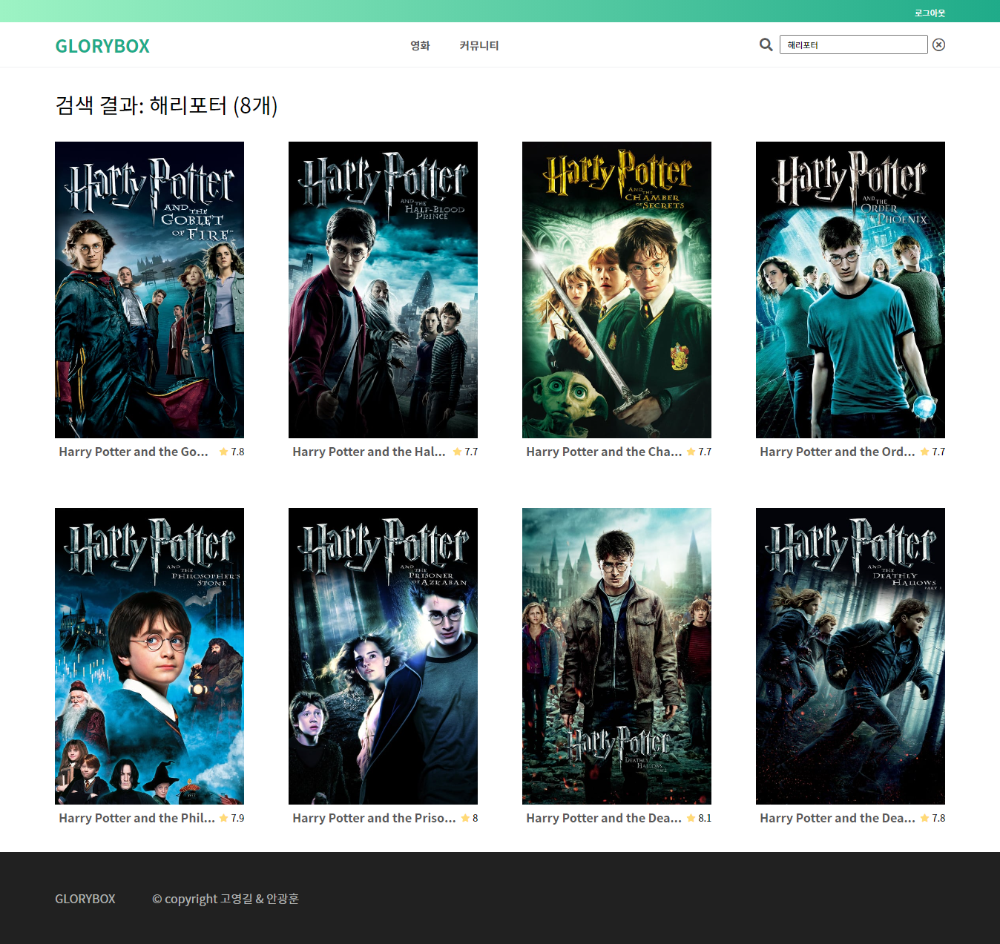
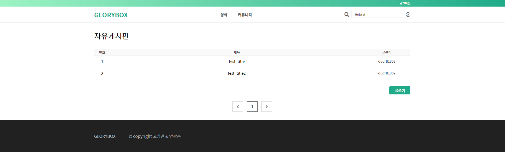
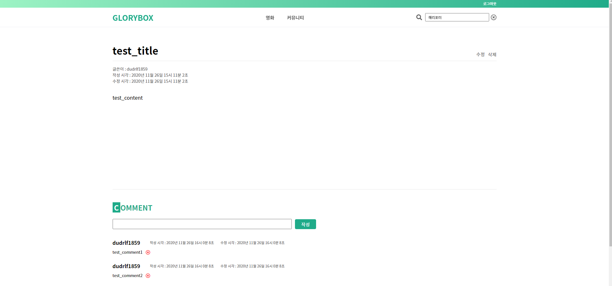

[TOC]

# FINAL PROJECT - GLORYBOX

> Maintainer: 고영길, 안광훈
>
> 고(영)길 안(광)훈을 따서 GLORYBOX


# INTRO

## Stack

- Back-end

  - Django, sqlite

- Front-end

  - Vuejs

- Trello, Gitlab

  

## Goal setting

> 아래 계획대로 기능을 구현하였습니다.

- Print Movie List
- Recommend movies for each users
- Search movie by title, overview ..
- Review system
- Community system


## Plan

> 업무 분담
>
> - 고영길 - 백엔드 (Django)
> - 안광훈 - 프론트엔드 (Vue.js)


Trello를 이용하여 업무 분담된 Task를 모두 적고 Todo, progressing, Done로 분류하여 정리했습니다. 

- Green - Back-end
- Blue - Front-end




# Main results


## ERD


```
# modeling

movies
	Movie
	Genre
	Review
community
	Article
	Comment
accounts
	User
```


## Home page




## Key function

### 1. Movie list

> - The Movie Database(TMDB) API를 이용하여 인기순 1000개의 데이터를 저장했습니다.
>- 인기 영화 탭에서는 데이터베이스에서 인기영화 상위권중에서 랜덤하게 20개를 보여줍니다.
> - 장르 탭에서는 각 장르가 포함되어있는 영화만 보여줍니다.

- 전체 영화


- 인기 영화




- 장르별 영화




### 2. Movie detail, Review

> - 영화의 제목, 개봉일, 평점 등 자세한 내용을 보여줍니다.
> - 유저는 영화에 좋아요를 눌러 선호 영화 목록을 만들 수 있습니다.
> - 유저는 영화에 리뷰를 생성  / 수정 / 삭제 할 수 있습니다. 리뷰는 리뷰 내용과 점수가 포함됩니다.




### 3. Recommend Movie

> - 유저의 선호 영화 목록에 기반하여 추천하는 영화 를 보여줍니다. 추천 영화 풀을 생성하여 랜덤하게 항상 12개의 영화를 보여줍니다.
>
> - 알고리즘
>
>   - 선호 영화가 없음 - 랜덤한 영화
>
>   - 선호 영화가 있는 경우
>
>     - TMDB API의 Recommend를 이용. 선호 목록의 영화를 API에 요청하여 추천 영화 목록을 받습니다. 이를 추천 영화 풀에 추가합니다. DB에 없는 영화를 받을 경우 DB에 추가합니다.
>
>     - 선호 영화 목록의 영화에 대해서 다음 알고리즘에 따라 추천 영화를 추출하여 추천영화 풀에 추가합니다.
>
>       1. 선호 영화 목록들의 장르들에 대해 나온 횟수에 따라 장르 랭크를 정합니다.
>       2. 모든 장르들의 조합에 대해 그 장르를 포함하고 있는 영화들을 찾아 풀에 추가합니다. 조합은 랭크가 높은 장르들에 대한 조합부터 고려합니다.
>       3. 풀의 개수가 36개가 넘어가면 종료합니다.
>
>       * 풀에서 12개의 영화를 뽑아 유저에게 보여줍니다.
>
>       - 풀이 12개가 되지 않으면 나머지를 랜덤한 영화로 채웁니다.




### 4. Search Movie

> - 단어를 입력하면 search algorithm에 따라 부합한 영화 목록을 보여줍니다.
> - 알고리즘
>   - TMDB API의 search movie를 사용하여 검색 결과를 영화 풀에 추가합니다. DB에 없는 영화를 받을 경우 DB에 추가합니다.
>   - 영화풀에 다음 알고리즘에 따라 검색 결과를 추출하여 영화 풀에 추가합니다.
>     - 검색 단어를 단어별로 (띄어쓰기로 구분) 나누어 조합을 생성합니다.
>     - 각 조합이 영화의 title, original_title, overview에 포함되어 있으면 영화 풀에 추가합니다.




### 5. Community

> - 각 영화에 리뷰를 남길 수 있으므로 자유게시판 형식으로 작성 할 수 있습니다.
> - 유저는 각 Article에 댓글을 생성 / 삭제 할 수 있습니다.

- Article List




- Article detail




# Other

- 모든 유저 인증은 rest_freamwork_jwt token을 사용하여 인증 정보를 확인했습니다.
- 필요한 부분에서 ajax를 사용하여 비동기 요청을 보냅니다.
- RESTful한 url을 지향했습니다.
- 필요한 부분에서 HTTP 상태 코드를 반환합니다.


## Desired things...

### Back-end

- Search Algorithm에 대해서 한글을 단어별로 구분하기 때문에 형태소에 따른 검색이 어렵다. Elasticsearch plugin의 analysis-nori를 사용하여 형태소 분석을 도입하려고 하였으나 윈도우 환경에서 플러그인 설치에 어려움이 있어 형태소 분석을 적용하지 못했다.
- Search results가 Serializer를 사용하여 반환하였더니 id순으로 자동 정렬되어 나타난다. 각각 검색 중요도 랭크를 부여하여 정렬하려고 하였으나 serializer의 정렬에 어려움이 있어 검색의 정확도가 떨어진다.
- Serialize하는 과정에서 One to many field가 오류를 자주 일으켜서 각각 char, int field로 바꾸었다. 그 결과로 정보를 얻어올 때 한번의 과정이 더 생겨서 비효율적이다.
- sqlite가 arrayfield를 지원하지 않아서 modeling이 더 복잡해졌다. 테이블과 컬럼을 더 줄일 수 있었는데 아쉽다.

- Back - Front를 완전히 분담하여 진행하였는데 동시에 일을 시작했고, **각각의 기능 완성 - 테스트**가 아니라 **디자인 기반마련 -> 대부분의 기능 구축 -> 테스트**의 순으로 진행하여 시간을 효율적으로 활용하지 못했다. 각 부분에서 비슷한 에러를 겪었는데 하나의 기능을 먼저 테스트 해봤다면 다음 과정의 시간을 단축 할 수 있었을 것이다.

### Front-end

- 반응형 웹페이지를 구현할 계획이었으나 시간이 부족해서 하지 못했다. 모바일에서도 이용할 수 있게 만들고 싶었는데 아쉽다.
- 이미 완성형에 가까운 다른 페이지의 디자인을 많이 참고해서 만드는 방식으로 만들었더니 시간을 많이 단축할 수 있었다. 디자인까지 밑바닥부터 시작했다면 제 시간에 완성하지 못했을 터였다.
- 프로젝트 완성에 집중하느라 코드의 구조를 세심하게 짜지 못했다. 기능이나 UI별로 좀 더 세분화해서 컴포넌트, 상태 관리 등을 할 수 있었을 것 같은데 아쉽다.
- 에러 핸들링을 아예 못했다. 자잘자잘한 에러들이 분명 발생할텐데 시간이 촉박해서 하지 못했다. 아쉽다.
- vue와 react는 비슷하면서도 다르다. 코드를 짜고 운영하는 방식에서의 차이는 확실히 느껴졌지만 기본적인 원리는 동일한 것 같다. 이미 react를 조금 경험해 봤기에 어렵지 않게 관련 개념들을 익힐 수 있었다. 이번 기회에 vue를 익힌 것이 훗날 많은 도움이 될 것 같다.
- 관통 프로젝트 이외에 다른 사람과 협업하여 완성한 첫 프로젝트이다. 프론트엔드와 백엔드를 분리해서 각자의 영역에서 작업하면서 느꼈던 건 동료를 믿는 것이 중요하다는 것이다. 내가 맡은 부분을 열심히 하며, 동료가 맡은 부분은 동료가 열심히 해주리라 신뢰하고 내 영역에 집중하는 것이 필요하다는 걸 느꼈다. 혼자서 모든 일을 하는 것이 편하다고 느낄 수 있지만, 신뢰할 수 있는 동료와 함께 작업하는 것이 속도도 더 빠르고 배울 점도 더 많다.