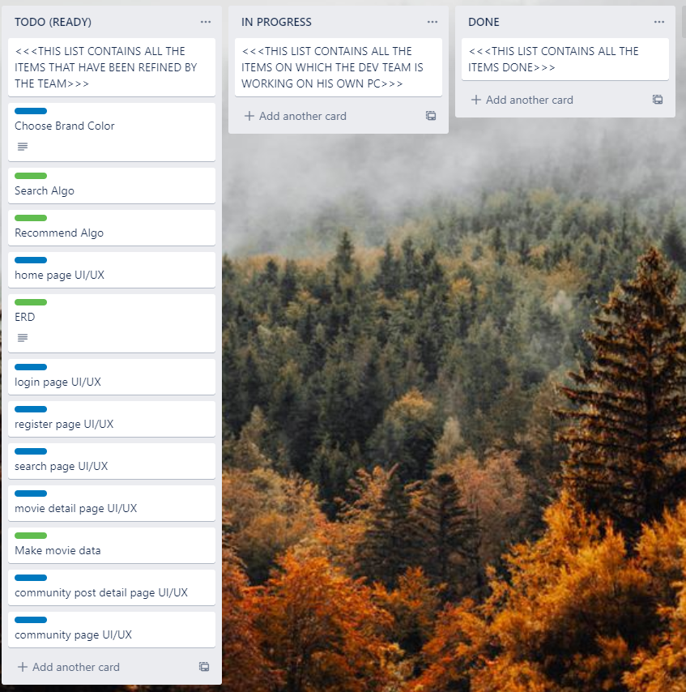
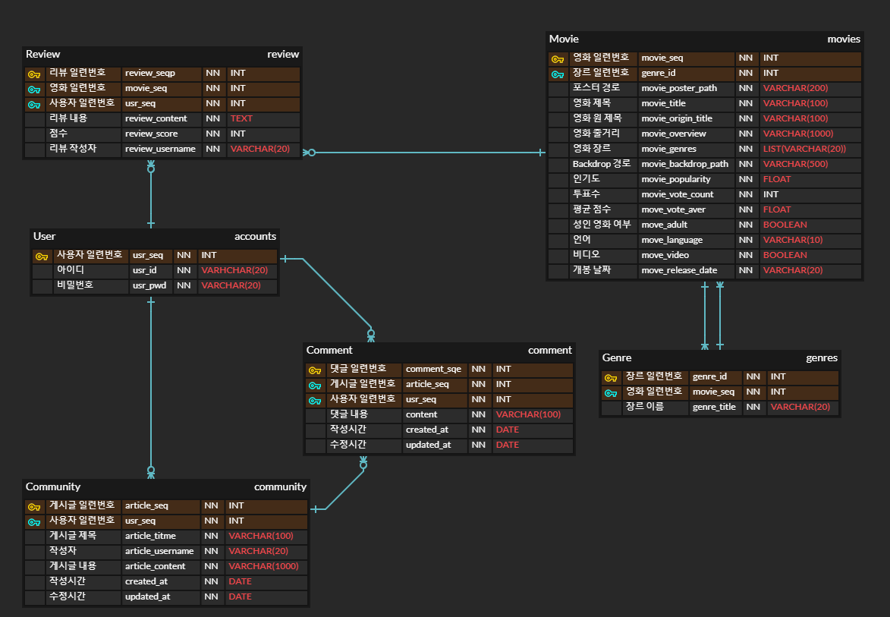

[TOC]

# FINAL PROJECT

> Maintainer: 고영길, 안광훈


# INTRO

## Stack

- Django, python

- Vuejs

- Trello

  

## Goal setting

> 아래 계획대로 기능을 구현하였습니다.

- Print Movie List
- Recommend movies for each users
- Search movie by title, overview ..
- Review system
- Community system


## Plan

> 업무 분담
>
> - 고영길 - 백엔드 (Django)
> - 안광훈 - 프론트엔드 (Vue.js)


Trello를 이용하여 업무 분담된 Task를 모두 적고 Todo, progressing, Done로 분류하여 정리했습니다. 

- Green - Back-end
- Blue - Front-end




# Main results


## ERD




```
# modeling

movies
	Movie
	Genre
	Review
community
	Article
	Comment
accounts
	User
```


## Key function

### Movie list

> - The Movie Database(TMDB) API를 이용하여 인기순 1000개의 데이터를 저장했다. Pagenation을 사용했습니다.
>
> - 인기 영화 탭(Popular)에서는 데이터베이스에서 인기영화 상위권중에서 랜덤하게 20개를 보여줍니다.
> - 장르 탭에서는 각 장르가 포함되어있는 영화만 보여줍니다.


### Movie detail, Review

> - 영화의 제목, 개봉일, 평점 등 자세한 내용을 보여줍니다.
> - 유저는 영화에 좋아요를 눌러 선호 영화 목록을 만들 수 있습니다.
> - 유저는 영화에 리뷰를 생성  / 수정 / 삭제 할 수 있습니다. 리뷰는 리뷰 내용과 점수가 포함됩니다.


### Recommend Movie

> - 유저의 선호 영화 목록에 기반하여 추천하는 영화 를 보여줍니다. 추천 영화 풀을 생성하여 랜덤하게 항상 12개의 영화를 보여줍니다.
>
> - 알고리즘
>
>   - 선호 영화가 없음 - 랜덤한 영화
>
>   - 선호 영화가 있는 경우
>
>     - TMDB API의 Recommend를 이용. 선호 목록의 영화를 API에 요청하여 추천 영화 목록을 받습니다. 이를 추천 영화 풀에 추가합니다. DB에 없는 영화를 받을 경우 DB에 추가합니다.
>
>     - 선호 영화 목록의 영화에 대해서 다음 알고리즘에 따라 추천 영화를 추출하여 추천영화 풀에 추가합니다.
>
>       1. 선호 영화 목록들의 장르들에 대해 나온 횟수에 따라 장르 랭크를 정합니다..
>       2. 모든 장르들의 조합에 대해 그 장르를 포함하고 있는 영화들을 찾아 풀에 추가합니다. 조합은 랭크가 높은 장르들에 대한 조합부터 고려합니다.
>       3. 풀의 개수가 36개가 넘어가면 종료합니다.
>
>       * 풀에서 12개의 영화를 뽑아 유저에게 보여줍니다.
>
>       - 풀이 12개가 되지 않으면 나머지를 랜덤한 영화로 채웁니다.


### Search Movie

> - 단어를 입력하면 search algorithm에 따라 부합한 영화 목록을 보여줍니다.
> - 알고리즘
>   - TMDB API의 search movie를 사용하여 검색 결과를 영화 풀에 추가합니다. DB에 없는 영화를 받을 경우 DB에 추가합니다.
>   - 영화풀에 다음 알고리즘에 따라 검색 결과를 추출하여 영화 풀에 추가합니다.
>     - 검색 단어를 단어별로 (띄어쓰기로 구분) 나누어 조합을 생성합니다.
>     - 각 조합이 영화의 title, original_title, overview에 포함되어 있으면 영화 풀에 추가합니다.


### Community

> - 각 영화에 리뷰를 남길 수 있으므로 자유게시판 형식으로 작성 할 수 있습니다.
> - 유저는 각 Article에 댓글을 생성 / 삭제 할 수 있습니다.


# Other

- 모든 유저 인증은 rest_freamwork_jwt token을 사용하여 인증 정보를 확인했습니다.
- 필요한 부분에서 ajax를 사용하여 비동기 요청을 보냅니다.

