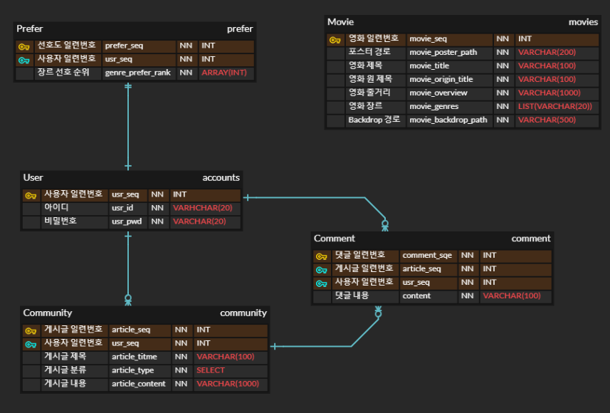
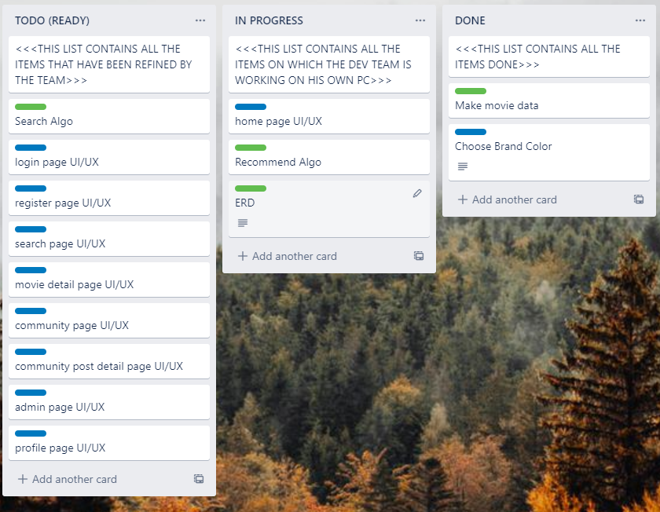
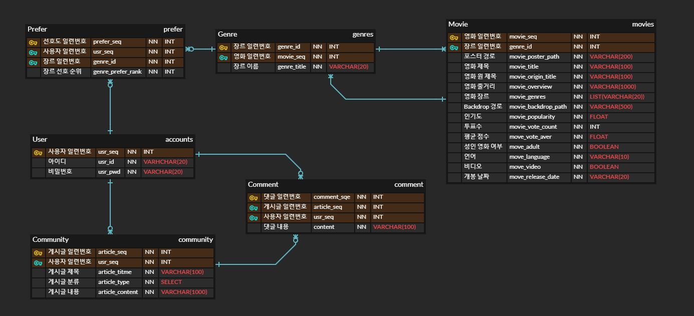
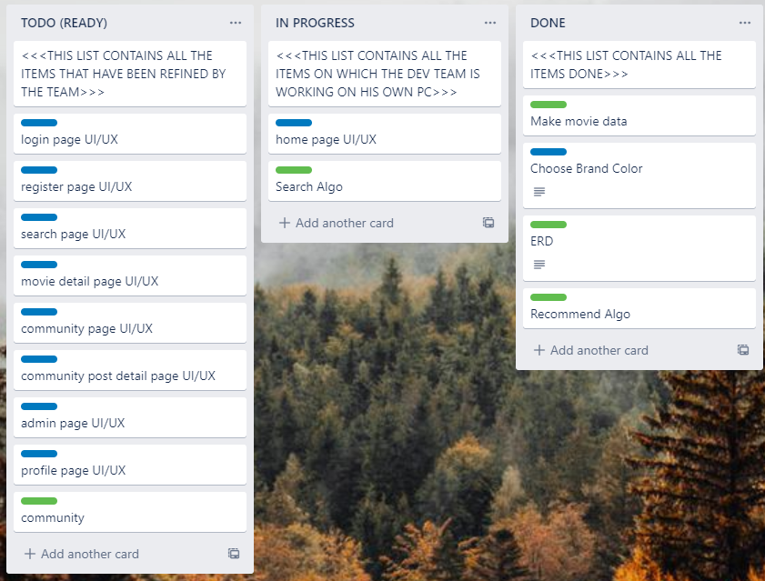
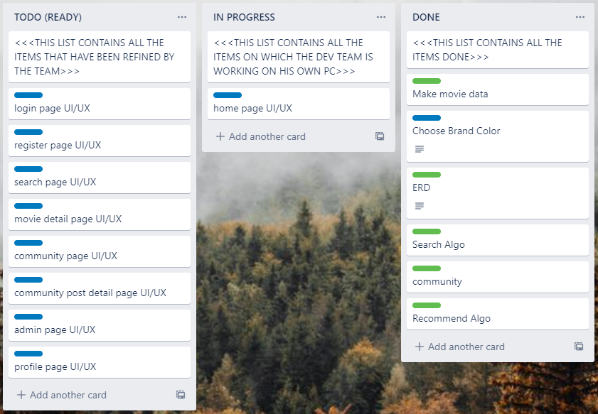

### # Records: Back-end part

## 1119

### ERD




### Structure

```
server
	accounts
	movies
		fixtures
	community
	server
```


### Recommend Algorithem

- User마다 장르 선호도 순위를 매겨서 선호하는 영화 장르 fool에서 랜덤하게 출력하는 방식
- 작성 중...

```python
def recommend_movies(request, user_pk):
    genre_url = URLMaker()
    genre_json = requests.get(genre_url.getGenres()).json()
    genre_list = [x['name'] for x in genre_json['genres']]
    genre_list.sort()
    movies = Movie.objects.none()
    rank = {}
    prefer = Prefer.objects.get(pk=user_pk)

    if not Prefer.objects.get(pk=user_pk).exists():
        Prefer.objects.create(user=user_pk, prefer_movie_genre=[0] * 19)

    if request.method == 'POST':
        selected_movie_genres = request.data['genres']
        for genre in selected_movie_genres:
            prefer[genre_list.index(genre)] += 1
        prefer.save()

    for i in range(19):
        if prefer[i]:
            if prefer[i] in rank:
                rank[prefer[i]].append(i)
            else:
                rank[prefer[i]] = [i]

    # case 1: most prefer genre
    if len(rank[max(rank.keys())]) == 1:
        movies += Movie.objects.filter(genres__contains=genre_list[rank[max(rank.keys())][0]])
        if len(movies) >= 10:
            serializer = MovieSerializer(random.sample(movies, 10), many=True)
            return Response(serializer.data)

    # case 2: contain some genres
    prefer_genre = reduce(lambda x, m: x + m, rank.values(), [])
    for i in range(len(prefer_genre), -1, -1):
        for com in coms(prefer_genre, i):
            movies += Movie.objects.filter(genres__contains=[genre_list[x] for x in com])
            if len(movies) >= 10:
                serializer = MovieSerializer(random.sample(movies, 10), many=True)
                return Response(serializer.data)
    pks = random.sample(range(1, 1001), 10 - len(movies))
    movies = Movie.objects.filter(pk__in=pks)
    serializer = MovieSerializer(movies, many=True)
    return Response(serializer.data)
```


### Make Movie data

- From TMDB, get 1000data of poplular movies.
- filed : title, original title, overview, backdrop path, poster path, genres


### results




<hr>

## 1120


### ERD 수정




### Recommend Algorithm

- Prefer을 ArrayField에서 MtoMField로 바꿈.
- Detail 몇가지는 Front와 합친 후 추가 예정

```python

@api_view(["GET", "POST"])
def recommend_movies(request, user_pk):
    movies = Movie.objects.none()

    if request.method == 'POST':
        selected_genres = request.data['genres']
        for selected in selected_genres:
            prefer = Prefer.objects.filter(user_id=user_pk, genre_id=selected)
            if prefer.exists():
                prefer[0].rank += 1
            else:
                prefer = Prefer(user_id=user_pk, genre_id=selected, rank=1)
                prefer.save()

    user_prefer = [x.genre_id for x in Prefer.objects.filter(user_id=user_pk)]
    # case 1: most prefer genre
    if len(user_prefer) == 1:
        temp_movies = Movie.genres.filter(genre_id=user_prefer[0])
        movies |= temp_movies
        if len(movies) >= 10:
            pks = random.sample(range(1, len(movies)), 10)
            movies = movies.filter(id__in=pks)
            serializer = MovieSerializer(movies,  many=True)
            return Response(serializer.data)

    # case 2: contain some genres
    if user_prefer:
        for i in range(len(user_prefer), -1, -1):
            for com in coms(user_prefer, i):
                temp_movies = Movie.objects.all()
                for cur_genre in com:
                    temp_movies = temp_movies.filter(genres=cur_genre)
                movies |= temp_movies
                if len(movies) >= 10:
                    pks = random.sample(range(1, len(movies)), 10)
                    temp_movies = movies.filter(id__in=pks)
                    serializer = MovieSerializer(temp_movies,  many=True)
                    return Response(serializer.data)

    pks = random.sample(range(1, 1000), 10 - len(movies))
    temp_movies = Movie.objects.filter(id__in=pks)
    movies |= temp_movies
    serializer = MovieSerializer(movies, many=True)
    return Response(serializer.data)
```


### Search Algorithm

- 검색 단어를 split
- 각 단어를 영화제목이 많이 포함한 순서대로 Movie data에 추가하여 Response

```python
@api_view(['GET'])
def search_movies(request, target):
    target_words = target.strip().split()
    movie = Movie.objects.none()
    for i in range(len(target_words), 0, -1):
        for com in coms(target_words, i):
            movie |= Movie.objects.filter(title__contains=list(com))
    serializer = MovieSerializer(movie, many=True)
    return Response(serializer.data)
```


### results




<hr>

## 1123

### Modify Movie Data, Model

```python
class Movie(models.Model):
    title = models.CharField(max_length=100)
    origin_title = models.CharField(max_length=100)
    overview = models.CharField(max_length=1000)
    genres = models.ManyToManyField(Genre, related_name='genre_movie')
    poster_path = models.CharField(max_length=500)
    backdrop_path = models.CharField(max_length=500, null=True, blank=True)
    popularity = models.FloatField()
    vote_count = models.IntegerField()
    video = models.BooleanField()
    adult = models.BooleanField()
    origin_language = models.CharField(max_length=10)
    vote_average = models.FloatField()
    release_date = models.CharField(max_length=20)
    
# movies/views.py
...
new_movie = Movie(
                    title=temp['title'],
                    origin_title=temp['original_title'],
                    poster_path=temp['poster_path'],
                    overview=temp['overview'],
                    backdrop_path=temp['backdrop_path'],
                    popularity=temp['popularity'],
                    vote_count=temp['vote_count'],
                    video=temp['video'],
                    adult=temp['adult'],
                    origin_language=temp['origin_language'],
                    vote_average=temp['vote_average'],
                    release_date=temp['release_date']
                )
...
```


### Movie List pagination

```python
# movies/views.py
...
    movies = Movie.objects.all()
    if len(movies) // 20 < page:
        content = {'Error': 'Unavailable page number'}
        return Response(content, status=status.HTTP_404_NOT_FOUND)
    else:
        movie = movies[(page - 1) * 20:page * 20]
    serializer = MovieSerializer(movies, many=True)
    return Response(serializer.data)
...
```


### Get popular Movies

```python
# movies/views.py
@api_view(["GET"])
def popular_movies(request):
    movies = Movie.objects.order_by('popularity')[:20]
    serializer = MovieSerializer(movies, many=True)
    return Response(serializer.data)
```


### Get specific genre of movie

```python
# movies/views.py
@api_view(["GET"])
def genre_movies(request, genre):
    genre_url = URLMaker()
    genre_list = requests.get(genre_url.getGenres()).json()
    genre_dict = {x['name']: x['id'] for x in genre_list['genres']}
    movies = Movie.objects.filter(genres=genre_dict[genre])
    serializer = MovieSerializer(movies, many=True)
    return Response(serializer.data)
```


### Get detail of movie

```python
@api_view(["GET"])
def movie_detail(request, movie_pk):
    movie = Movie.objects.get(pk=movie_pk)
    serializer = MovieSerializer(movie)
    return Response(serializer.data)
```


### Community Modeling

```python
class Article(models.Model):
    title = models.CharField(max_length=100)
    content = models.TextField()
    like_users = models.ManyToManyField(settings.AUTH_USER_MODEL, related_name='like_reviews')
    created_at = models.DateTimeField(auto_now_add=True)
    updated_at = models.DateTimeField(auto_now=True)
    user = models.ForeignKey(settings.AUTH_USER_MODEL,
                             on_delete=models.CASCADE)


class Comment(models.Model):
    content = models.CharField(max_length=100)
    article = models.ForeignKey(Article, on_delete=models.CASCADE)
    user = models.ForeignKey(settings.AUTH_USER_MODEL,on_delete=models.CASCADE)
```

> - CRUD
> - Comment CRUD
> - like system


### results



